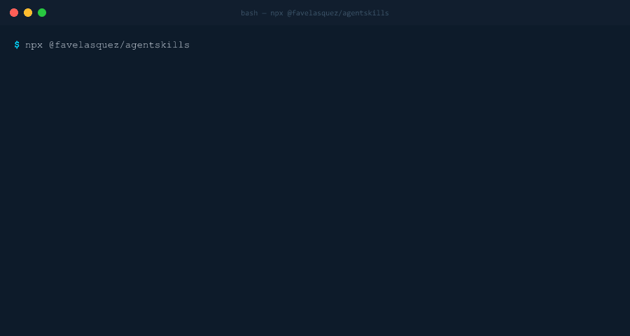

> Detect your project's tech stack and install AI agent skills in one command.

## Install

```bash
npx @favelasquez/agentskills
```

## Usage

The interactive CLI will:

1. Detect your stack (auto or manual selection)
2. Suggest matching skills
3. Ask which agents to install for
4. Download and write skill files

## Demo


## Options

| Flag | Purpose |
|------|---------|
| `--claude-code`, `--cursor`, `--copilot`, etc. | Target specific agent |
| `--yes`, `-y` | Skip prompts, install all suggested |
| `--dry-run`, `-d` | Preview without writing |
| `--dir <path>` | Scan specific directory |

## Custom Repositories

Install from any GitHub repository:

```bash
npx @favelasquez/agentskills
# → Select "Install from custom repository"
# → Enter URL or select saved repo
```

Repositories must follow this structure:

```
repo/
├── skill-name/
│   ├── v1/
│   │   └── usage.md
│   └── v2/
│       └── usage.md
```

The skill path is saved automatically, so you can reuse repositories without re-entering the path.

## Author

https://github.com/favelasquez

## License

MIT
